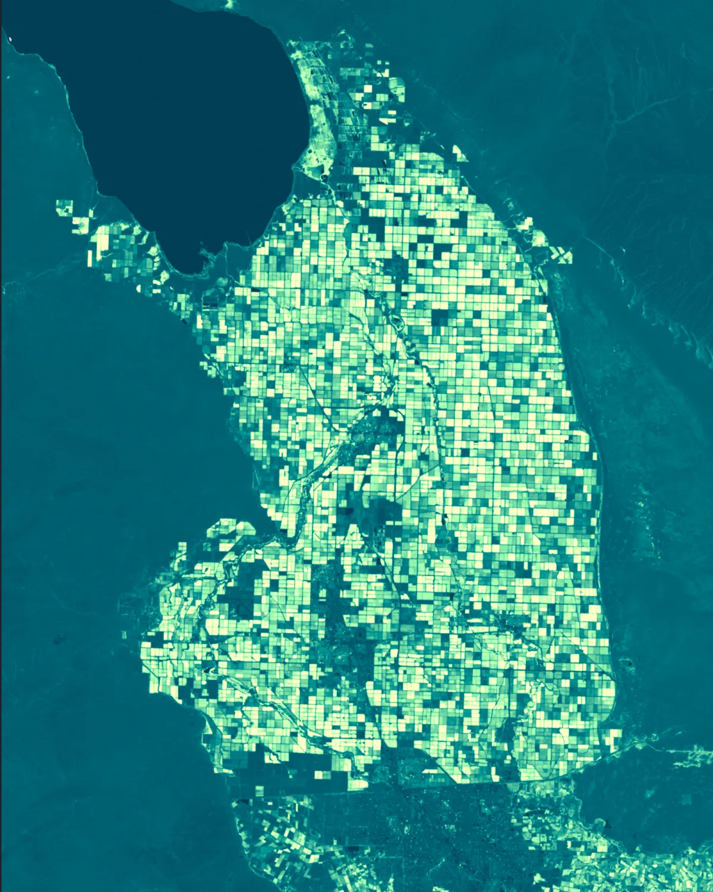

# sentinel-2-cog-deckgl-raster



<sub>NDVI over the Salton Sea and California's Imperial Valley — irrigated fields glowing against the desert, rendered live in the browser from per-tile Sentinel-2 COGs (Emrld colormap).</sub>

*This README and the code was generated by Claude with my direction. I am
including the `.claude/memory/` files to add context if someone finds that
helpful. Also please check the latest from the Dev Seed repos listed below
before you start developing.*

Browser-side rendering of Earth Genome's Sentinel-2 Temporal Mosaics
([source.coop/earthgenome/sentinel2-temporal-mosaics](https://source.coop/earthgenome/sentinel2-temporal-mosaics))
straight from cloud-optimized GeoTIFFs over HTTP Range. No tile server, no
derived data, no hosting — the browser opens each per-tile COG and the
mosaic engine fans out byte-range reads per visible map tile.

This project is deliberately a **stress test of the COG pyramid workflow**.
TCI assets here are ~400 MB each (vs. the ~5–20 MB CDL tiles in the
predecessor project), but per-file size mostly doesn't matter — what
matters is how many MGRS source tiles are visible at once, since each
contributes header reads and tile range fetches.

## Run

```bash
cd web
npm install
npm run dev       # http://localhost:5455
```

No data prebake. STAC items are fetched live from
`stac.earthgenome.org` on mount, filtered to the
`data.source.coop` CORS-open subset, then handed to
`MosaicLayer`.

## What the app does

Two kinds of render selectable from the in-app panel:

- **RGB (TCI)** — the precomposed 3-band TCI `visual` asset rendered as one
  `COGLayer` per item (the seam-free naip-mosaic pattern), with a uniform
  brightness gain (`ScaleColor`, 1.0 = faithful TCI). *Not* a B04/B03/B02
  composite — that earlier path produced tile seams; see `docs/SEAMS.md`.
- **Spectral indices** — normalized-difference indices computed in a shader
  over two bands via `MultiCOGLayer`, rescaled, and sampled through a colormap:
  NDVI (B08/B04) and NDWI (B03/B08) — both all-10 m bands. (NDBI/NDMI were
  dropped: pairing 20 m B11 with a 10 m band seamed.) The colormap set is
  **deuteranopia-friendly**: the red-green ramps (rdylgn, spectral) were dropped
  because they're indistinguishable to red-green colorblind viewers. What's left
  is the perceptually-uniform sequentials (cividis/viridis/plasma), a blue-red
  divergent (rdbu), and four CARTOColors palettes injected via
  `web/src/cartoColormaps.ts` (Emrld, Earth, Geyser, Sunset — not in the shipped
  sprite). A symmetric range centers divergent ramps at 0. See
  `docs/SPECTRAL_INDICES.md` for the registry and the catalog roadmap.

Other panel controls: an AOI **draw** tool (drag a box to set the search
extent), a search-clear (×), a labels toggle, and a load scoreboard with a
copy-failures debug list.

**Keyboard shortcuts:** `/` focus search · `M` marker · `L` labels · `D` draw
AOI · `Esc` cancel/clear. The search-place marker is transient — it appears on
a search/jump and auto-hides the moment you pan or zoom; press `M` to summon it.

See [`docs/CUSTOMIZE.md`](./docs/CUSTOMIZE.md) for how to change the AOI/year,
add a spectral index, swap colormaps, re-theme the panel, or edit shortcuts.

A year dropdown (2022 / 2023 / 2024) drives the STAC `datetime` filter.
The collection advertises 2018–2021 too but those items live on a
non-CORS bucket (`ei-imagery.s3.us-east-2`), so they're filtered out
upstream. See `docs/MULTICOG_NDVI.md` for the full design notes and the
upstream patterns we leaned on.

## Changing the area of interest

The AOI is encoded as two values near the top of `web/src/App.tsx`:

- `STAC_BBOX` — `[W, S, E, N]` passed to the STAC `/search` to bound the
  items enumerated.
- `initialViewState` — where the map opens.

You can edit those by hand, but the way this project was actually
developed is by **prompting Claude**. Open Claude Code in this repo and
say something like:

> *send me to the Netherlands with buffer*
>
> *show me California, zoomed to the central valley*
>
> *try Vietnam and a big area around*
>
> *switch to ndvi and use viridis*
>
> *can we add a built-up index*

Claude will update `STAC_BBOX`, `initialViewState`, render modes,
shaders, or UI as appropriate, and HMR will pick it up.

The same conversational approach is how the rest of this app got built
— render pipeline wiring, retry/backoff, the in-app failure scoreboard,
the basemap swap, the multi-band swap, the NDVI/colormap UI. See the
project [`CLAUDE.md`](./CLAUDE.md), [`docs/MULTICOG_NDVI.md`](./docs/MULTICOG_NDVI.md),
and the `.claude/memory/` directory for the context Claude was working
with.

## Using this with other datasets

Nothing here is Sentinel-2-specific below the asset layer — the engine just
opens Cloud-Optimized GeoTIFFs over HTTP Range. To point it at a different
collection, the format matters more than the source:

- **The data must be COGs** — internally tiled with overviews, so the reader can
  fetch one map tile without downloading the file. A plain GeoTIFF won't stream.
- **A STAC API or static catalog** is the low-friction path — `src/stac.ts`
  enumerates items and reads asset hrefs. You can also hardcode an `items.json`.
- **EPSG:3857 avoids in-shader reprojection.** This collection is already
  web-mercator; other CRSs work but lean on `@developmentseed/proj` (the CDL
  predecessor reprojected EPSG:5070 Albers — see its git history).
- **CORS must be open** on the tile host (and the STAC host). Browser-side range
  reads are blocked otherwise; `stac.ts` filters CORS-blocked hosts here.

### Where to find Dev Seed's examples

The cleanest way to learn the patterns for a new dataset is to read Dev Seed's
own examples — each demonstrates a different asset shape:

- **deck.gl-raster examples** —
  [github.com/developmentseed/deck.gl-raster](https://github.com/developmentseed/deck.gl-raster)
  → the `examples/` directory, with a live gallery at
  [developmentseed.org/deck.gl-raster](https://developmentseed.org/deck.gl-raster/).
  The ones this app leaned on:
  - **naip-mosaic** — the seam-free "one COGLayer per item" RGB pattern + the
    NDVI live-filter shape (what `RGB` mode here is built on).
  - **vermont** — the same NDVI math over a single scene.
  - **sentinel-2** — multi-band composite presets (true/false-color band combos).
- **deck.gl-geotiff examples** —
  [github.com/developmentseed/deck.gl-geotiff](https://github.com/developmentseed/deck.gl-geotiff)
  → `MosaicLayer` / `COGLayer` / `MultiCOGLayer` usage, the layer tier this app
  sits on.
- **@developmentseed/geotiff** —
  [github.com/developmentseed/geotiff](https://github.com/developmentseed/geotiff)
  → the COG reader itself, if you need to debug byte-range/decode behavior.

Match your dataset to the closest example's **asset layout** (single precomposed
RGB asset vs. separate per-band COGs), copy that example's layer + pipeline
shape, then swap the STAC endpoint and asset keys. `docs/MULTICOG_NDVI.md`
records exactly which findings from each example carried into this app.

> The `0.7` line moves fast and the shader-pipeline shape has changed across
> minor versions — **check the latest from those repos before you start**; the
> snippets here are pinned to specific versions.

## Architecture

```
stac.earthgenome.org  ──┐
   STAC /search          │  runtime fetch on mount (src/stac.ts)
                         ▼
                  PartialSTACItem[]  →  MosaicLayer
                                              │
                                              ▼ per STAC item in viewport
                                COGLayer (RGB: TCI visual asset)
                                  — or —
                                MultiCOGLayer (indices: 2 bands)
                                              │
                                              ▼ per visible map tile
                                      RasterTileLayer (internal)
                                              │
                                              ▼ HTTP Range
                          data.source.coop/earthgenome/.../{Bnn}.tif
                                              │
                                              ▼
                                CompositeBands  (auto-prepended)
                                              │
                                              ▼
                          discardBoundlessPadding
                                  → NdviFromRG?  → LinearRescale  → Colormap?
```

`MultiCOGLayer` opens its own GeoTIFFs (one per band slot) and uploads
each as a `r16unorm` texture. The `composite` prop maps named slots to
RGB channels before the user pipeline runs.

### Files of note

| file                          | role                                                            |
|-------------------------------|-----------------------------------------------------------------|
| `web/src/App.tsx`             | map shell, mode/year/brightness/colormap state, draw tool, layer wiring |
| `web/src/stac.ts`             | STAC `/search` paginator, CORS-host filter, required-band check |
| `web/src/renderPipeline.ts`   | `INDICES` registry, per-index `sources`/`composite`/pipeline    |
| `web/src/shaders/ndvi.ts`     | `NormalizedDifference` — `(r-g)/(r+g)`, shared by all indices    |
| `web/src/loadStats.ts`        | pub-sub store backing the in-panel load scoreboard              |
| `web/src/discardBlack.ts`     | `discardBlack` (RGB) + `discardBoundlessPadding` (indices)      |
| `docs/SPECTRAL_INDICES.md`    | curated index registry + awesome-spectral-indices roadmap       |
| `docs/MULTICOG_NDVI.md`       | design notes + upstream-example findings                        |

## Stack

- [`@developmentseed/deck.gl-geotiff`](https://github.com/developmentseed/deck.gl-geotiff)
  — `MosaicLayer` + `MultiCOGLayer`.
- [`@developmentseed/deck.gl-raster`](https://github.com/developmentseed/deck.gl-raster)
  — shader-pipeline building blocks (`CompositeBands`, `LinearRescale`,
    `Colormap`, the shipped `colormaps.png` sprite).
- [`@developmentseed/geotiff`](https://github.com/developmentseed/geotiff)
  — COG reader and decode worker pool.
- [`@developmentseed/proj`](https://github.com/developmentseed/proj)
  — EPSG resolver (collection is EPSG:3857 already, but the layers
    want one).
- [`@chunkd/source-http`](https://github.com/linz/chunkd) — HTTP Range
  source under the hood.
- deck.gl 9.3 + luma.gl 9.3 + maplibre-gl 5 + react-map-gl 8 + React 19.

**Please check the latest from those Dev Seed repos before you start
developing** — the `0.7` line is moving fast, the shader-pipeline shape
has changed across minor versions, and the working snippet in this app
is pinned to specific versions.

## Data shape

Items are `MGRSTILE_YYYY-MM-DD_YYYY-MM-DD` (e.g. `31UFT_2024-04-01_2024-08-01`).
Each item has assets `B01..B12`, `B8A` (single-band uint16 reflectance per
Sentinel-2 band) plus `TCI` (3-band uint8 RGB visualization composite).
RGB renders the **TCI** `visual` asset directly (one COGLayer per item);
indices pull **B03/B04/B08** (all 10 m) through MultiCOGLayer. `stac.ts` requires
all four index bands plus a TCI href, skipping items missing any.

- CRS: EPSG:3857 (all bands; verified via `gdalinfo /vsicurl/...`).
- Per-band texture format: `r16unorm` — sampler returns `raw / 65535`
  in `[0,1]`. The default RGB stretch of `rescaleMax: 0.05` ≈ 3000 raw.
- No-data fill: `MultiCOGLayer` calls `fetchTile(..., boundless: true)`
  internally, so out-of-COG pixels arrive as real zeros. The
  `discardBoundlessPadding` module at the front of the pipeline drops
  them so adjacent MGRS tiles don't show black seams.

## Footguns

- **`sources` is reference-compared.** `MultiCOGLayer` does
  `props.sources !== oldProps.sources` (`multi-cog-layer.ts:309`) and on
  any mismatch reopens GeoTIFFs and refetches tiles. Rebuilding the
  sources object inline in `renderSource` causes a full refetch on every
  React render — including brightness-slider ticks. We cache per
  `(mode, source.id)` in `App.tsx`.
- **`updateTriggers.renderTile` is mandatory** for any prop change that
  should affect already-rendered tiles. Without it, `RasterTileLayer`
  caches the per-tile `RenderTileResult` and the new pipeline never
  reaches the GPU (`raster-tile-layer.ts:338`).
- **`boundless: true` zero padding.** The old TCI path used our own
  `getTileData` with `boundless: false` plus a `discardBlack` shader.
  `MultiCOGLayer`'s internal `fetchTile` is hardcoded to
  `boundless: true`, so the new path needs `discardBoundlessPadding`
  (or equivalent) up front.
- **MGRS tile gaps at low zoom.** Each MGRS item gets its own inner
  `TileLayer`, so adjacent items' tile grids don't share edges in
  mercator. Cross-UTM-zone seams (e.g. 31N / 32N at 6°E) are wider
  because the MGRS tiles themselves are defined in their respective UTM
  zones. Live with it, or pad with a darker basemap. See
  `docs/MULTICOG_NDVI.md` for the architectural reason.
- **RGB tile-edge seams (NDVI is clean).** A faint grid of seams shows in
  RGB at every zoom but not in NDVI — because NDVI's normalized ratio
  cancels the sub-pixel absolute-brightness discontinuities that RGB
  exposes. Root cause is the per-item independent reprojection meshes /
  tile grids, not the data (the product is seamless) and not mesh
  tolerance or overview mixing (both tested, neither helped). Full
  investigation in `docs/SEAMS.md`.
- **Source count > file size.** A 400 MB COG and a 5 MB COG cost the
  same memory if the visible-tile count and overview level are the
  same. The real cost driver is "how many sources are visible" — i.e.
  MGRS-tile count inside the viewport. RGB pulls 3 band COGs per item;
  NDVI pulls 2.
- **CORS.** Only `data.source.coop` is verified open. The collection
  also publishes annual mosaics on `ei-imagery.s3.us-east-2`, which is
  CORS-blocked from the browser; `stac.ts` filters those out so they
  don't 403-spam the console. Net effect: only 2022–2024 are visible.
- **STAC pagination.** `fetchStacItems` follows `rel=next` to
  exhaustion (capped by `maxItems`). Wide global bboxes will be slow on
  first paint; narrow the bbox or raise `minZoom`.

## What's not here

The CDL predecessor app had palette LUTs, per-class histograms, pixel
picking, EPSG:5070 → 3857 reprojection in-shader, and a bake step for
STAC. None of that is needed for Sentinel-2 — the bands are already in
Web Mercator and the composites/indices are GPU-side. The git history
of the predecessor (`cdl-lonboard-05-2026`) has all of it if it's ever
needed back.

`loadGeotiff.ts`, `getTileData.ts`, and `renderTile.ts` implement the
per-tile custom-loader path used by **RGB** (one COGLayer per item on the TCI
asset). Index modes don't use them — MultiCOGLayer owns its own tile loading.

## Memory & context

- [`CLAUDE.md`](./CLAUDE.md) — project-wide instructions Claude was
  working under.
- [`docs/MULTICOG_NDVI.md`](./docs/MULTICOG_NDVI.md) — design notes for
  the MultiCOG/NDVI swap, including findings from the upstream
  deck.gl-raster examples (naip-mosaic for the NDVI live-filter
  pattern, vermont for the same NDVI math, sentinel-2 for the multi-
  band composite presets).
- [`.claude/memory/`](./.claude/memory/) — running notes Claude kept,
  including the carryover from the CDL predecessor
  (`PRIOR_CDL_MEMORY.md`) and a stack/footgun retrospective
  (`MEMORY.md`).
- [`HANDOFF-FROM-CDL.md`](./HANDOFF-FROM-CDL.md) — the
  diagnosis/fix note that bootstrapped this app off the CDL scaffold.
